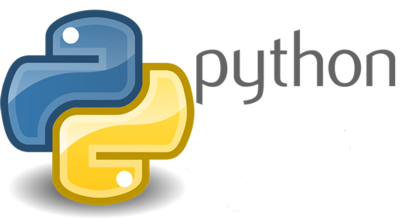

Engine2learn
============

Machine Learning Interface into the UE4 Game Engine.




.. image:: images/spark-logo.png
   :alt: Spark
   :scale: 60%
.. image:: images/tensorflow-logo.png
   :alt: TensorFlow
   :scale: 60%


Connecting the Vagrant VM+Spark+Tensorflow world to the Game Dev world.


What is Engine2Learn?
---------------------
Engine2Learn is an UnrealEngine 4 (UE4) plugin as well as a python library. These two components together allow game developers and machine learning (ML)
engineers to work hand in hand by connecting a highly parallelized ML pipeline (think: Spark and Tensorflow) with
any UE4 game and use this game as a reinforcement learning (RL) environment.
The ultimate goal for Engine2Learn is to create better game AI and smarter NPCs using state-of-the-art RL methods and deep learning (DL) models.

.. figure:: images/screenshot_ue4_scene.png
   :alt: Engine2Learn in Action

   The Engine2Learn UE4 plugin in action. The camera actor (blue) can be setup to send pixel observations with each step back to the ML-client,
   which in turn controls the agent's movements.

The Engine2Learn python library provides a simple RL interface allowing algorithms to reset the game
environment (the "Env"), set a random seed for debugging purposes, step through the Env tick by tick, and execute different actions
(called action- and axis-mappings in UE4) at the subsequent time steps.


The UE4 Side
++++++++++++
Game developers can use the Engine2Learn UE4 plugin to specify actor properties in the game, whose values will be sent to the ML
pipeline after each step (e.g. the health value of a character actor or enemy actor). Also, UE4 camera actors can be used as scene observers
such that they send their pixel recordings as 3D-tensors (w x h x RGB) after each time step back to the connected ML client.
In the future, we will make audio- and sound-observations available to the ML-side as well.

Game developers need to specify a port (via the plugin's settings), on which the game will listen for incoming ML control connections.

The Engine2Learn plugin also supports automatic building/packaging/cooking procedures of ML-ready games from the UE4 Editor into the
highly parallelized ML-world. Our plugin can thus deploy one game to hundreds or thousands of ML nodes automatically before starting the main ML script,
for example a Spark application running TensorflowOnSpark.


The python (ML) Side
++++++++++++++++++++
Once a control tcp connection into a running game has been initiated by an ML client, this client can send commands to the game and use the game as
a learning environment.
The environment is represented on the python side as an engine2learn.Env object and offers the following interface for ML algorithms:

- seed: Set the random seed to some fixed value (for debugging and pseudo-random (reproducible) game play).
- reset: Set the game to its initial state.
- step: Perform a single tick (step) on the game by sending "action" information to UE4 (axis- and/or action-mappings).

The step method returns an observation (following the single step), which can be used by the ML algorithm to update a mathematical model.
The number of actual game ticks per step as well as a fake delta-time can be sent along with each step command.


Quick setup
-----------
1) UE4-Plugin

Before being able to work with the Engine2Learn UE4 plugin, you will need to install another UE4 plugin, called UnrealEnginePython, which is developed
and maintained by 20tab. You will also need a working python installation on the machine where your game will run (normally you local PC).

You have the following two options for installing the Engine2Learn UE4 plugin:
- for an individual game
- for your UE4 installation

In order to add the plugin to a single game, copy the contents of the directory `engine2learn/Plugins/` to your UE4 project folder's `Plugins` directory.


2) Python engine2learn lib
Do a simple pip-install on all of your parallel ML nodes (or your local machine for testing and debugging).
```
pip install engine2learn
```


Synopsis Python3 Script
-----------------------

- write a simple ML-agent against a UE4 game:

.. code-block:: python
    :linenos:

    from engine2learn.envs.ue4_env import UE4Env
    import random

    if __name__ == "__main__":
        # instantiate a UE4Env running on the local machine (give it a port to connect to (optional 2nd arg: hostname))
        env = UE4Env(6025)
        # connect to the UE4 game
        env.connect()
        # set the random seed for the Env
        env.seed(10)

        # reset the game to its initial state
        obs_dict = env.reset()

        # specify some parameters
        num_ticks_per_step = 4  # number of ticks to perform with each step (actions will be constant throughout a single step)
        delta_time = 1 / 60  # the fake delta time to use for each tick

        for i in range(1800):
            obs_dict = env.step(delta_time=delta_time, num_ticks=num_ticks_per_step,
                                axes=("MoveRight", random.choice([-1.0, -1.0, 1.0, 1.0, 0.0])),
                                actions=("Shoot", random.choice([False, False, False, True])))

            # now use obs_dict to do some RL :)


.. Next steps and Full Documentation
   +++++++++++++++++++++++++++++++++
   If you would like to create more complex levels (or entire Games with many Screens and Levels), read the
   `spygame documentation <https://sven1977.github.io/spygame/>`_, in which we'll create a full-blown 2D platformer Level
   (sorry about spygame's documentation still being work in progress).


Contribute to MaRLEnE
---------------------
If you would like to contribute to the Engine2Learn project, the following items are currently open:

- create example games in UE4 that can be easily (or not so easily) reinforcement learnt
- create machine learning modules using deepmind's sonnet and add them to our engine2learn python lib
- add audio/sound support (send sound wave observations from the game to the ML-clients)
- write a wrapper class that integrates engine2learn into the openAI-gym interface

.. .. figure:: https://raw.githubusercontent.com/sven1977/spygame/master/examples/platformer_2d/screen1.png
    :alt: Lost Vikings - Sample spygame Level
    Lost Vikings - Sample spygame Level - *All graphics are (c) Blizzard Entertainment Inc (The Lost Vikings)*


Unreal
======

Having your project client compiled in your shared `/vagrant` directory, use `Vagrantfile-unreal` to start and provision the vagrant environment passing environment parameter, as in example below:

```
$ VAGRANT_VAGRANTFILE=Vagrantfile-unreal PROJECT_NAME='MyProject' vagrant up
```


