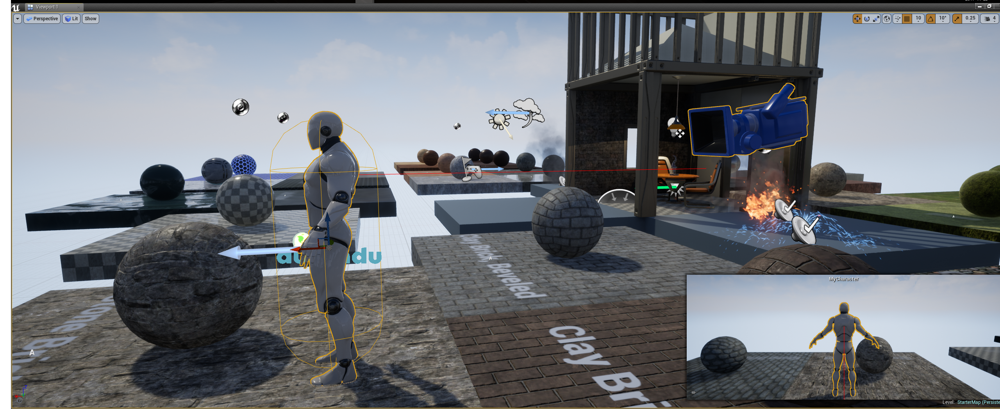

.. spygame documentation master file, created by
   sphinx-quickstart on Thu Jun 15 19:39:47 2017.
   You can adapt this file completely to your liking, but it should at least
   contain the root `toctree` directive.

Welcome to the engine2learn documentation!
==========================================

Engine2Learn is a library for bringing reinforcement learning to the UnrealEngine 4
-----------------------------------------------------------------------------------

.. toctree::
   :maxdepth: 3
   :caption: Contents:
   :numbered:

   readme_link.rst
   intro.rst
   e2l_reference.rst

Indices and tables
==================

* :ref:`genindex`
* :ref:`modindex`
* :ref:`search`
