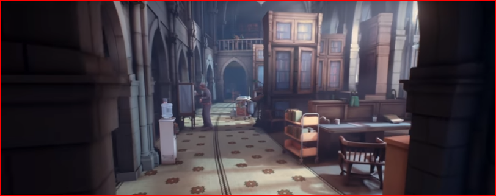
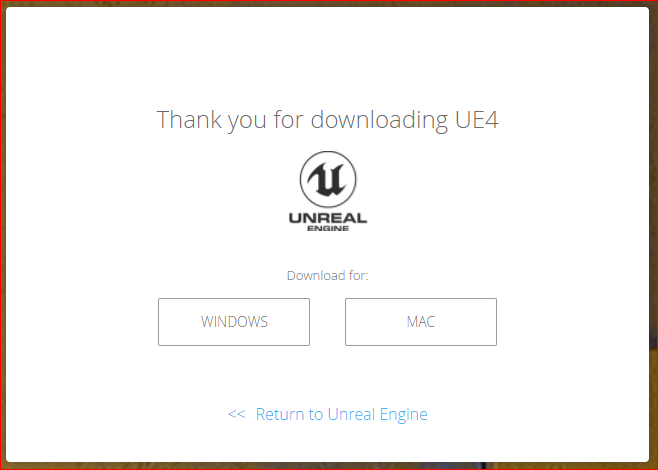
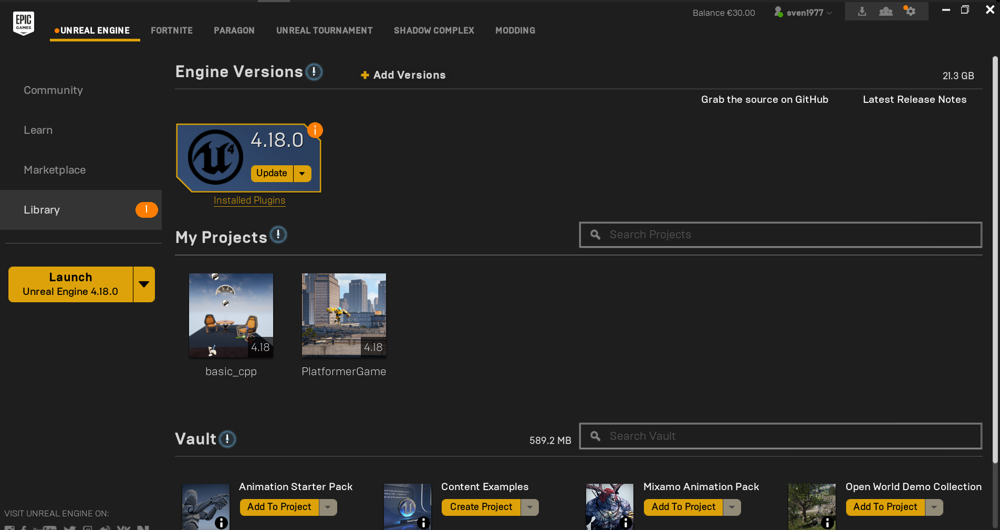
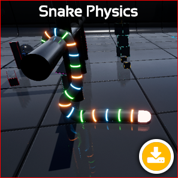
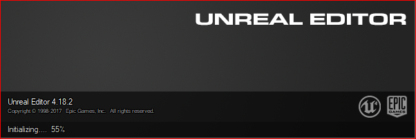
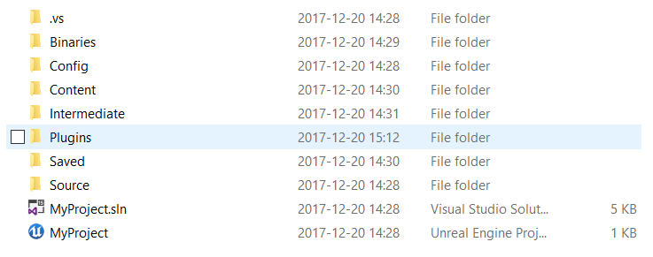
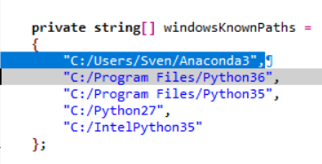
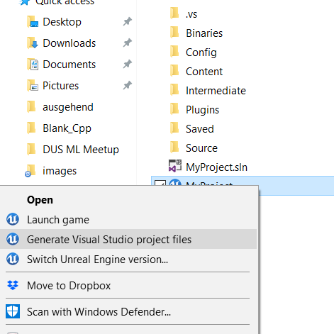
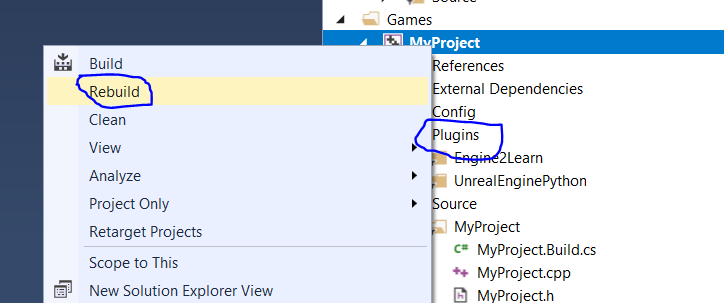

TensorForce and MaRLEnE
=======================

**Or: How to Hook Up State-Of-the-Art Reinforcement Learning Algorithms to an UnrealEngine 4 Game**

<!---->

<!--## MaRLEnE: Machine- And Reinforcement Learning ExtensioN for (game) Engines-->

### Introduction

In this tutorial, we will introduce a new class of TensorForce environments: Unreal Engine 4 (UE4) games.
Unreal Engine is a popular and blockbuster-capable game engine used by over one million game developers worldwide to create
games like *Arkham City*, *Borderlands 2* or *Bioshock*.
With a novel UE4 plugin (called *MaRLEnE*) and the new `UE4Environment` subclass of TensorForce's `Environment` interface
you can now connect your RL algorithms remotely to an arbitrary UE4 game and run them against it,
just as you would already do for Atari2600 games or other popular RL environments (CartPole anyone?).
The UE4 game needs to be compiled with MaRLEnE (Machine- and Reinforcement Learning ExtensioN for (game) Engines)
in order to be converted into an RL-learnable environment.

The MaRLEnE extension was designed to b With this move, we are hoping to bridge the gap between the currently very disjoint worlds of academic, bleeding-edge
machine- and reinforcement learning (ML & RL) on one side and professional game development on the other side.
In order to "smarten up" their game characters, game devs currently have to work through strenuously
detailed scripting techniques such as state machines (think: prohibitively complex if-then-else blocks),
behavior trees, or utility functions. Contrary to that, reinforcement learning algorithms work on a unified, general,
and well-understood framework, called a "Markov Decision Process (MDP)", which is interestingly completely
analogous to how game engines work internally, with timed ticks, input interrupts and output generation.
Therefore, arbitrary games can be learnt (at least to a certain extend) by such algorithms without much
preparation necessary by the game (MDP) designer. Also, the ever accelerating scientific progress in the fields of
deep learning and machine learning can immediately be tethered into games (even already published ones)
without much tinkering and on game-specific AI
The ultimate goal of combining UE4 with TensorForce is to enable game developers to pick arbitrary agents in their
games, tick a box in the properties panel of that agent that says "learn in world", then wait for an overnight
RL-optimization algo to finish, and - on the next day - watch the agent act cleverly in the game world.



<sub>What if ... you could check a simple tickbox for some game character and it would become intelligent over night?
(*The Occupation* created on UE4 by Epic Games)</sub>


### Setup Summary for MaRLEnE and TensorForce

Quite a lot of software components need to be installed in order to run the example described in this tutorial.
Here is a quick summary of these installation steps (all described in detail in this blog post):

* UnrealEngine4 (UE4) - to run the game
* A python3 installation running on the same machine as your UE4 install - this can also be an Anaconda installation
* MS Visual Studio - to compile the necessary UE4 plugins
* The 2 necessary UE4 plugins: MaRLEnE and UnrealEnginePython - to convert the game into an RL-learnable
environment
* Your machine learning environment including the TensorForce library - to run RL algorithms on the game

<!--The only requirements necessary to run this setup is the UE4 Editor itself (called simply UE4 in the following), two UE4 Plugins
(MaRLEnE by ducandu and UnrealEnginePython by 20tab) and the TensorForce library (by reinforce.io).-->

In the following, we will go step by step through the process of setting up an RL-ready game,
starting from installing UE4 on your PC/Mac, downloading and installing a toy game (TODO: check: a fun version of the
classic SpaceInvaders),
and compiling and setting up all necessary plugins via Visual Studio.
We will then explain, how to add special observer objects to your game in order to be able to receive
state signals from the game environment into your TensorForce scripts.
These observers can be attached to camera actors sending pixel information to the RL machinery
or simply provide positional information (x/y/z) for certain game actors. We will also show you how the standard input
settings in UE4 (e.g. keyboard or mouse inputs) directly define your RL environment's action space. MaRLEnE and
TensorForce support discrete, continuous, as well as, composite action spaces (combinations of different spaces).
In the last part of this tutorial, we will run a simple dqn-agent (deep Q-learning) against the game using TensorForce.
We will measure the agent's performance over time and watch the agent live in our UE4 editor while it becomes better
and better at playing the game.

In a future blog post, we will further dive into the aspect of parallelization of reinforcement learning algorithms and
explain the "headless" (no-rendering/server mode) Linux capabilities of MaRLEnE in combination with TensorForce.

We will now go through all the installation steps necessary to get UE4 as well as all its necessary plugins up and
running.
Building and installing UE4 plugins can be a tedious process, but once you have built each plugin once, you can reuse
them for all your following games and projects, so bear with me here and let's pull through this together.


#### Get UnrealEngine 4

Go to [Epic's website](unrealengine.com) to download the newest version of UE4 for PC or Mac. You will be asked to
create an account (or use your Google or Facebook account) before you can download the software, but - trust me -
it'll be worth it.
UE4 is generally a free and open sourced software. However, if you start making money with selling games that you
have created with UE4, they will take a (I believe: fair) share of your profits.

The current version as of this writing is 4.18.[some subversion], but as always, when you start with something and
are not committed yet: Get the latest one.

<!--
<sub>Download Screen for UE4</sub>-->

Execute the installer and follow the installation instructions for UE4, then start the "Epic Games Launcher" that
comes with the UE4 editor. You may be asked to login again with your Epic credentials and should now see a screen
similar to this one:


<sub>Epic Games Launcher Screenshot with the already installed UE4 Editor (version 4.18.0)</sub>

Follow the UE4 installation instructions inside the Launcher to install the newest UE4 version
on your local machine.


#### 1.2 Get MS Visual Studio 2017

Go to the [Visual Studio download page](https://www.visualstudio.com/downloads/) to get "Visual Studio Community" (2017
should work fine) and install MS VS on your local machine. Again, you will have to create an account with MicroSoft in
order to be able to run the software, but other than that, the installation procedure should be straight forward.

We will only use VS - for this tutorial - to quickly compile our plugins. However, this will already be a good exercise
into working with the Unreal Engine's C++ code in case you are interested in writing your own C++ based  games in the
future.

#### 1.3 Get the Game for this Tutorial

We will be using a simple 3D physics-simulated game (called "Snake Physics") for this tutorial,
because it's easy to setup and modify, and also to learn by different RL agents. In fact, our game is so easy,
that even a random agent will perform astonishingly well.
However, we will prove in the benchmarking section of this post that our algo does learn a good and close-to-optimal
policy and that TensorForce's different agent types will all kick the random dummy's butt (and maybe even our human
ones, depending on our gaming skills, that is).


<sub>
Our toy game: Snake Physics ((c) Elhoussine Mehnik) downloadable from ue4resources.com
</sub>

Go to [UE4 Resources' website](http://ue4resources.com/3d-projects) and download the "Snake Physics" template game by
clicking on the yellow download button (highlighted green above) and then downloading the 4.18 version of the game
from google drive. Save the .rar file in some folder of your choice and unpack it into that same folder.

In the Unreal world, each game lives in its own folder (where ever that is) and all its settings, assets, scripts,
etc.. go into special subdirectories. Also, at the root of that game folder, you will find the
SnakePhysics.uproject file.


#### 1.4 Test-Start the Game in the UE4 Editor

Just to make sure everything works up until here, you should start up the downloaded game in the UE4 editor.
Bring up the "Epic Games Launcher" (installed together with UE4) and click on the Engine version you would like to
launch (at this point, you will only have one version of UE4 installed). You should first see this startup screen:



And at some point will be asked to chose a project to open in the editor. Navigate to the SnakePhysics.uproject file
and click "Open".
The game should now load in the editor and you should see something like this:


<sub>
Our Snake Physics game opened in the UE4 editor.
</sub>

#### 1.5 Getting the Source Code for MaRLEnE and UnrealEnginePython

Now it's time to install and setup the 2 needed plugins, MaRLEnE and UnrealEnginePython. The UnrealEnginePython
plugin will be obsoleted in future releases, which will also conveniently remove the python3 requirement on
your UE4 machine, but for now (alpha-testing and prototyping phase), we will still depend on it.

Since Snake Physics is a "blueprint" (BP) game as opposed to a C++ game, we will compile our C++-based plugins using a
different dummy project.
The following steps will seem counterintuitive and we might change this in a future version of
this post, but for now, it's how we will get things done:

In the UE4 editor, click on File->New Project, then make sure you have the C++ tab selected (as opposed to the
BluePrint tab) and select the "Basic Code" template in a location (directory + project name) of your choice.
Then click on "Create Project".
This will create a new dummy project that we will use to compile our plugins and you can erase the entire project
later, if you like.
Visual Studio should open up at the same time as the new project is loaded in the UE4 editor. If it doesn't, no worries,
we can open it up later. But do please close the new project in UE4 now as it might cause file access problems
when we try to re-build the game (and the plugins) later.

We will now "git-clone" the source code for both our plugins from github.
First make sure you have the git-shell (or any other github client) installed on your machine.
If not, get the software from [here](https://desktop.github.com/).
Make sure the shell clients `Git CMD` or `Git-Shell` are installed as well (we will not use the GUI part here).
Now open one of these git-capable shells and `cd` into a directory of your choice (this does not have to be the
new C++ game's directory). Run the following commands:

```
git clone https://github.com/ducandu/MaRLEnE.git
git clone https://github.com/20tab/UnrealEnginePython.git
```

Next, create a folder `Plugins` in the dummy C++ game's directory and copy(!) the newly cloned git-folders
`MaRLEnE/Plugins/MaRLEnE` and `UnrealEnginePython/` into that `Plugins` directory, so that the two
folders `MaRLEnE` and `EnrealEnginePython` now reside inside `Plugins`.


<sub>
The newly created Plugins folder inside the C++ game's directory
</sub>

We now have to let UnrealEnginePython know, where to find our local python3 installation. This could be
an Anaconda environment or a "regular" python installation.
Open the file `UnrealEnginePython.Build.cs` in the folder `Plugins/UnrealEnginePython/Source/UnrealEnginePython/`
of our dummy C++-game and add the path to your local python executable to the `windowsKnownPaths` variable:



In an Explorer window in the dummy C++-game's folder, right-click on the .uproject file and select the option:
"Generate Visual Studio Project Files". This should rewrite the .sln file in that folder. Check whether the
timestamp of the file changes. If it doesn't, you may have specified a wrong python path.


<sub>
Re-generating necessary VS project files for compiling our plugins
</sub>

If Visual Studio is already opened, it'll probably tell you that the solution file (.sln) has changed and you can click on
the "Discard" option. If you don't have VS opened, double click on the re-written .sln file to open up the project in Visual Studio.
You should see now that the two plugins have been added to the Game's solution within VS' "Solution Explorer" panel.
In that panel, right-click on your game's name (mine is called "MyProject") and select "rebuild". This will build our
two plugins for your platform including the correct linkage to your python3 installation:


<sub>
Rebuild the dummy C++ project to get the correct plugin executables/dlls. Make sure the two plugins are present in
the "Solution Explorer" panel under the "Games" solution.
</sub>

You can exit VS now. Our plugins have been built successfully (in the Dummy project). In order to move the plugin builds
into our actual project, simply copy the two directories `MaRLEnE` and `UnrealEnginePython` from
the `Plugins` directory of the dummy game into a newly created `Plugins` directory inside the Snake Physics game.


### Activating the Plugins and Making them Work

Start the Snake Physics game from the Epic Launcher. By now, this project should be available as a quick link in the Launcher.
To make sure our plugins have been added to the game, check the main menu: *Edit->Plugins* and scroll down on the left side
to "Project" to see the two `MaRLEnE` and 'UnrealEnginePython' plugins active.


Now that the necessary plugins are active in our game, let's set them up. This will be the last step before we can
focus our attention on the reinforcement learning and TensorForce part of this project.

#### Generic MaRLEnE settings: Host and Port

When run against TensorForce RL-algos, UE4 games will be "remote environments", which means that TensorForce
communicates with the games via TCP/IP. Actions (keys pressed, mouse moves, etc..) will be sent from TensorForce
to the game to be used as faked player input and observations from the game, such as image pixels or some actor's
3D-position will be sent back to the RL-machinery.

Go to 'Edit->Project Settings' in the top UE4 menu. You should see


In order to do reinforcement learning on the game, we need to make sure that the RL-algo (TensorForce)
receives a useful observation signal from the environment (the UE4 game) at each time step. There are countless ways
of designing such a useful signal or combining many different signals into one, but for the purpose of this tutorial,
we will create a standard 84x84 pixel gray-scale image of the game scene and declare that to be our state/observation
signal. Let's do that first:

In the asset browser of the editor, look for the TODO: pawn? blueprint and double click on it to open the blueprint
(BP) in a special BP editor tab. In this tab, you can edit properties related to our snake character. Click on the
TODO: components? tab to see the setup of the different snake components. You should see the snake itself
as well as a camera actor that is attached to the snake via a camera TODO: boom?. Click on the camera actor and
the "Details" panel should show you the properties and setup of the actor. Click on the green "Add Component" button
and start typing "MLObserver" into the search field, then select a MLObserver to be added to the actor.
By clicking and dragging the new observer component, you can place it as a child of the camera component as is shown
here:


<sub>
Making the new MLObserver a child of our camera component.
</sub>

Now, click on the new MLObserver and check again in the "Details" panel, where you should now be able to define
the properties of the observer itself.
Check the tick-box TODO: "Scene Capture" as well as the grey-scale tick-box and make sure the format of
the captured image is 84x84 pixels (width and height fields).
Also double-check whether the type of the observer is set to "normal".


### the UE4 side (Game Developers)
Game developers can use the MaRLEnE UE4 plugin to specify properties in the game, whose values are being sent
to the ML pipeline after each step (e.g. the health value of a character or enemy). Also, UE4 camera actors can be
used as scene observers such that they send their pixel recordings as 3D-tensors (w x h x RGB) after each time step
back to the ML clients. In the future, we will make audio- and sound-observations available to the ML-side as well.

Game developer need to specify a port (via the plugin's settings), on which the game will listen for incoming ML
control connections.

The MaRLEnE plugin also controls automatic building/packaging/cooking procedures of ML-ready games from the UE4 Editor into the
highly parallelized ML-world (our plugin deploys one game to 100s of ML nodes automatically and starts a specified ML script).


### the python side (ML engineers)
Once a control connection into a running game has been initiated by the ML pipeline, it can send commands to the game and use the game as
a learning environment.
The environment is represented on the python side as an MaRLEnE.Env object and offers the following interface for ML algorithms:

- seed: Set the random seed to some fixed value (for debugging and pseudo-random (reproducible) game play).
- reset: Set the game to its initial state.
- step: Perform a single tick (step) on the game by sending "action" information to UE4 (axis- and/or action-mappings).
The step method returns an observation (following the single step), which can be used by the ML algorithm to update a mathematical model.

### quick setup
1) Get the latest UnrealEngine 4 for PC/Mac/Linux.
Go to [], then download and install the latest version of UE4.

2)

```
pip install MaRLEnE
```

2)


### synopsis
```python3

from MaRLEnE.envs.ue4_env import UE4Env
import random


if __name__ == "__main__":
    env = UE4Env(6025)  # instantiate a UE4Env (give it a port to connect to (optional 2nd arg: hostname))
    env.connect()  # connect to the UE4 game
    env.seed(10)  # set the random seed for the Env

    obs_dict = env.reset()  # reset the game to its initial state

    # specify some parameters
    num_ticks_per_step = 4  # number of ticks to perform with each step (actions will be constant throughout a single step)
    delta_time = 1 / 60  # the fake delta time to use for each tick

    for i in range(1800):
        obs_dict = env.step(delta_time=delta_time, num_ticks=num_ticks_per_step,
                            axes=("MoveRight", random.choice([-1.0, -1.0, 1.0, 1.0, 0.0])),
                            actions=("Shoot", random.choice([False, False, False, True])))

        # now use obs_dict to do some RL :)
```


### Cite

If you use MaRLEnE in your academic research, we would be grateful if you could cite it as follows:

```
@misc{mika2017MaRLEnE,
    author = {Mika, Sven and DeLoris, Roberto},
    title = {MaRLEnE: Bringing Deep Reinforcement Learning to the Unreal Engine 4},
    howpublished={Web page},
    url = {https://github.com/ducandu/MaRLEnE},
    year = {2017}
}
```


# Unreal

Having your project client compiled in your shared `/vagrant` directory, use `Vagrantfile-unreal` to start and provision the vagrant environment passing environment parameter, as in example below:

```
$ VAGRANT_VAGRANTFILE=Vagrantfile-unreal PROJECT_NAME='MyProject' vagrant up
$ VAGRANT_VAGRANTFILE=Vagrantfile-builder PROJECT_URL='https://github.com/20tab/UnrealEnginePython.git' PROJECT_NAME='UnrealEnginePython' vagrant up
```
